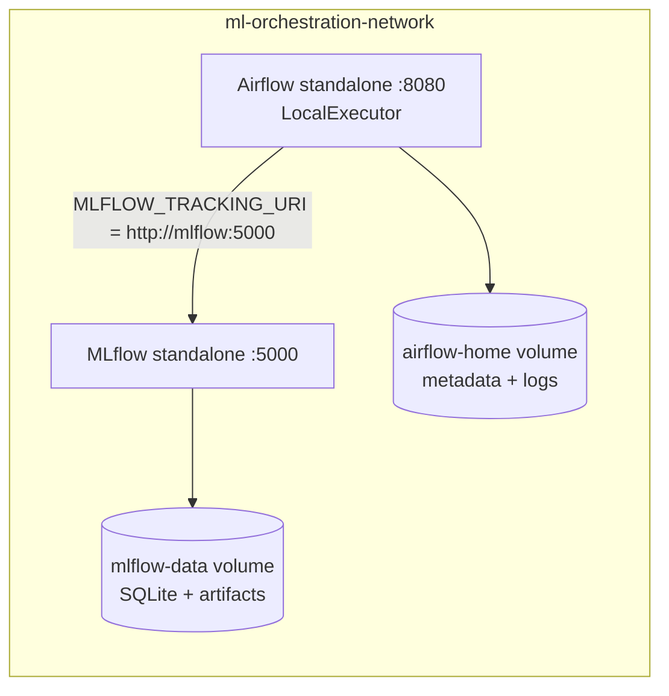
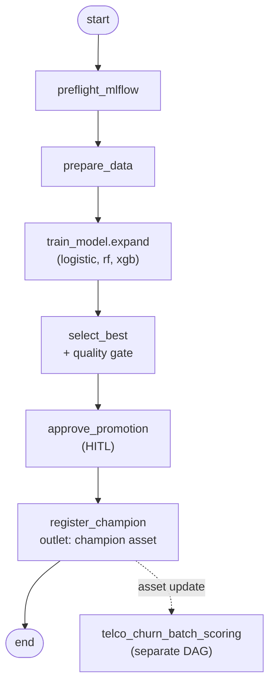

# ML Workflow Orchestration with Airflow 3 + MLflow

A single hands-on session that shows how to orchestrate a complete ML lifecycle
with **Apache Airflow 3** while using **MLflow** for experiment tracking and the
model registry. We train several churn models in parallel, gate on a quality
metric, get a human approval, register the winner as `champion`, and let an
**event-driven** DAG automatically score a batch whenever a new champion ships.

---

## 1. Learning objectives

By the end of the session attendees can:

- Author DAGs with the Airflow 3 **`airflow.sdk`** API (TaskFlow `@dag`/`@task`).
- Run tasks **in parallel** with dynamic task mapping (`.expand()`).
- Pass small metadata through **XCom** and large data through a shared volume.
- Track experiments, params, metrics, plots and models in **MLflow**.
- Promote a model with the **Model Registry** + a `champion` **alias**.
- Add a **quality gate** and a **human-in-the-loop (HITL) approval**.
- Trigger a downstream DAG with **Assets** (event-driven scheduling).
- Understand what changes when moving this to **production**.

---

## 2. Workshop flow

One promotion cycle, start to finish. Keep Airflow and MLflow open in separate tabs.

| Step | What you do | What the system does |
|------|-------------|----------------------|
| 1. Boot | `just up-d`, open both UIs | MLflow health-check passes, Airflow parses the DAGs |
| 2. Train | Unpause `telco_churn_training_pipeline`, trigger with defaults | `prepare_data` writes parquet; three mapped `train_model` tasks run in parallel |
| 3. Compare | Open the `telco-churn-airflow` experiment in MLflow | Each run logs datasets (Inputs tab), metrics, plots, and a model artifact |
| 4. Gate | Watch `select_best` in the Graph view | Picks the best `f1_score`; fails the run if it is below `min_metric_threshold` |
| 5. Approve | Open **Required Actions** on `approve_promotion` | HITL task waits up to one hour (`response_timeout`), then defaults to Approve |
| 6. Promote | After approval, check MLflow **Models** | `register_champion` registers the run and moves the `champion` alias; emits the champion Asset |
| 7. Score | Switch to `telco_churn_batch_scoring` | Asset schedule fires automatically; loads `models:/TelcoChurnModel@champion`, writes `data/processed/predictions.csv` |

To demo the quality gate failing, re-trigger with `min_metric_threshold: 0.99`.

---

## 3. Architecture



Pipeline flow (producer + asset-triggered consumer):



### Services and ports

| Service | URL / port | Purpose |
|---|---|---|
| Airflow UI | http://localhost:8080 | Orchestration, DAGs, HITL approvals |
| MLflow UI | http://localhost:5000 | Experiments, runs, model registry, artifacts |

---

## 4. Repository layout

```
.
├── docker-compose.yml          # mlflow + airflow (standalone, shared network)
├── .env.example                # optional overrides (ports, image tag)
├── justfile                    # convenience commands
├── airflow/                    # custom Airflow image (Airflow + ML libs baked in)
│   ├── Dockerfile
│   ├── requirements.txt
│   └── startup.sh
├── dags/
│   ├── telco_churn_training_pipeline.py   # producer
│   └── telco_churn_batch_scoring.py       # asset-triggered consumer
├── src/                        # shared ML helpers (imported inside DAG tasks)
│   ├── data_preprocessing.py
│   └── train.py
└── data/
    ├── telco_churn_full.csv
    └── telco_churn_scoring_sample.csv
```

---

## 5. Prerequisites

- Docker Desktop / Engine with **Docker Compose v2** (`docker compose`, not `docker-compose`).
- Allocate **at least 4 GB** (ideally 8 GB) of RAM to Docker, otherwise the
  Airflow API server may restart.
- [`just`](https://github.com/casey/just) (optional but recommended). Every
  recipe maps to a plain `docker compose` command you can run by hand.

---

## 6. Bring the stack up

```bash
just up-d          # or: docker compose up --build -d
```

First boot builds the Airflow image and pulls the MLflow image, so give it a
minute or two. Check progress:

```bash
just ps            # docker compose ps
just logs          # tail Airflow logs
```

Open the UIs (`just airflow-ui` / `just mlflow-ui`):

- Airflow: http://localhost:8080 — simple auth is enabled, so **any username
  logs you in as admin**.
- MLflow: http://localhost:5000

Both services share the `ml-orchestration-network` Docker network. Airflow tasks
call MLflow at `http://mlflow:5000` (the compose service name, not `localhost`).

---

## 7. Mentor walkthrough (the live demo)

> Keep the Airflow UI and the MLflow UI side by side. Airflow tells the
> *orchestration* story; MLflow tells the *experiment lineage* story.

1. **Show the DAGs.** In Airflow, point out the two DAGs and their tags.
   `telco_churn_training_pipeline` has a `@daily` schedule;
   `telco_churn_batch_scoring` has **no schedule** — it is driven by an Asset.

2. **Open the code.** Walk through `dags/telco_churn_training_pipeline.py`:
   - imports from `airflow.sdk`, operators from the `standard` provider;
   - heavy ML imports live **inside** the task functions (parsing stays light);
   - `params` (data path, experiment name, primary metric, threshold, registry
     alias) render in the UI.

3. **Trigger with config.** Unpause the DAG, then *Trigger DAG w/ config* and
   show the params form. Defaults are fine. Trigger it.

4. **Watch the fan-out.** In the **Graph** view, `train_model` expands into three
   mapped instances (logistic / rf / xgb) running in parallel under
   LocalExecutor. Open the **Grid** and a task's **Logs**.

5. **Inspect MLflow.** In the MLflow UI open the `telco-churn-airflow`
   experiment: three runs with params, metrics, the confusion-matrix / ROC
   artifacts, and a logged model. On each run, open the **Inputs** tab to show
   `telco_churn_train` (context: training) and `telco_churn_test` (context:
   evaluation) logged via `mlflow.data.from_pandas` + `log_input`. Metrics are
   linked to the eval dataset and the logged model.

6. **Quality gate.** `select_best` picks the highest `f1_score` and fails if it
   is below `min_metric_threshold`. (Re-trigger with a high threshold like `0.99`
   to demonstrate the gate halting the pipeline.)

7. **Human approval.** `approve_promotion` defers until someone acts in **Required
   Actions**. The wait is capped by `response_timeout` (one hour here; Airflow 3
   replaced the old `execution_timeout` on HITL operators). Approve to continue.

8. **Registration.** `register_champion` registers the best run's model as
   `TelcoChurnModel` and moves the `champion` alias. Show it in the MLflow
   **Models** tab (version + alias + tags).

9. **Event-driven scoring.** Because `register_champion` declares the champion
   Asset as an **outlet**, Airflow auto-triggers `telco_churn_batch_scoring`.
   Show it firing in the **Assets** view, then open its logs: it loads
   `models:/TelcoChurnModel@champion`, scores the sample, and writes
   `data/processed/predictions.csv`.

---

## 8. Concept callouts

- **`airflow.sdk`** is the stable Airflow 3 authoring namespace. The 2.x paths
  (`airflow.decorators`, `airflow.models.DAG`, `airflow.datasets`) are
  deprecated. Core operators (Bash/Python/Empty) moved to
  `apache-airflow-providers-standard`.
- **Assets replace Datasets.** A task declares `outlets=[asset]` to "produce" it;
  a consumer DAG sets `schedule=[asset]` to run on updates. `inlets` expose event
  metadata (source DAG/task/timestamp).
- **XCom vs storage.** XCom is for small metadata (run ids, paths, scalar
  metrics) and round-trips through the metadata DB. Datasets and model artifacts
  go to a shared volume / object store / MLflow — never through XCom.
- **Keep DAG parsing light.** The dag-processor imports every DAG file
  frequently. Import `mlflow`, `sklearn`, `xgboost` *inside* tasks so they load
  only on the worker.
- **`--serve-artifacts`.** The MLflow server proxies artifact upload/download, so
  Airflow tasks only need `MLFLOW_TRACKING_URI` — no S3 credentials on the worker.
- **HITL uses `response_timeout`.** `ApprovalOperator` defers to the triggerer
  and waits for a human. Pass `response_timeout` for that wait window. The old
  `execution_timeout` on HITL operators is deprecated in Airflow 3.
- **MLflow 3 model logging.** `mlflow.sklearn.log_model(..., name="model")` uses
  the `name` argument (not the 2.x `artifact_path`). Pair metrics with the logged
  model via `mlflow.log_metrics(..., model_id=..., dataset=...)`.
- **Registry needs a DB-backed store.** The Model Registry requires
  postgres/mysql/sqlite/mssql; a bare `./mlruns` directory alone is not enough.
  Here MLflow uses **SQLite** on the `mlflow-data` volume (fine for a workshop;
  use Postgres in production).

---

## 9. From workshop to production

This stack is intentionally simplified for teaching. Real deployments differ:

| Area | This workshop | Production |
|---|---|---|
| Airflow runtime | single container, `airflow standalone`, **LocalExecutor** | separate `api-server`, `scheduler`, `dag-processor`, `triggerer`, and `worker` services with **CeleryExecutor** (Redis broker) or **KubernetesExecutor** |
| ML dependencies | baked into a custom image (`airflow/Dockerfile`) | same baked-image approach (avoid `_PIP_ADDITIONAL_REQUIREMENTS`, which reinstalls on every boot); often per-task isolation via `@task.virtualenv`, `DockerOperator`, or `KubernetesPodOperator` so ML libs never touch Airflow core |
| Secrets / config | plaintext `.env`, `MLFLOW_TRACKING_URI` env var | Airflow **Connections/Variables** + a secrets backend (Vault, AWS/GCP secret manager); no plaintext credentials |
| Tracking / metadata | MLflow SQLite + Airflow SQLite on named volumes | Postgres (or MySQL) for both; managed backups |
| Artifact store | local path on `mlflow-data` volume (`--serve-artifacts`) | S3 / GCS / Azure Blob (+ optional MinIO) |
| Auth | `SIMPLE_AUTH_MANAGER_ALL_ADMINS` (everyone is admin) | FAB / OAuth / SSO with real RBAC |
| Image version | Airflow `3.1.7` on `python:3.12` | the latest patched 3.x (e.g. `apache/airflow:3.2.2`); the `airflow.sdk` API shown here is identical |
| Registration | re-registers on every approved run | idempotent promotion (guard against duplicate versions created by task retries), plus model validation/`mlflow.evaluate` before alias moves |

---

## 10. Troubleshooting

- **Airflow UI keeps restarting / 502** — give Docker more RAM (>= 4 GB).
- **Tasks can't reach MLflow** — use the service name `http://mlflow:5000`, not
  `localhost`, from inside containers. `preflight_mlflow` fails fast if it's down.
- **`RESOURCE_DOES_NOT_EXIST` registering a model** — the MLflow server must use
  a DB-backed store (this stack uses `sqlite:////mlflow/mlflow.db` on the volume).
- **Scoring column mismatch** — the scoring sample is a slice of the training CSV
  so one-hot columns line up. In production, persist the fitted preprocessor /
  log the model **signature** instead of relying on slice alignment.
- **Reset everything** — `just down` removes the `mlflow-data` and `airflow-home`
  volumes for a clean restart.

---

## 11. Versions

| Component | Version |
|---|---|
| Apache Airflow | 3.1.7 |
| `apache-airflow-providers-standard` | 1.11.1 |
| MLflow | 3.12.0 |
| Python | 3.12 |
| MLflow backend (workshop) | SQLite on `mlflow-data` volume |
| Airflow metadata (workshop) | SQLite on `airflow-home` volume |

> The latest Airflow release in 2026 is 3.2.x; this session pins 3.1.7 to match a
> known-good image. The authoring API (`airflow.sdk`, Assets, HITL) is the same.
